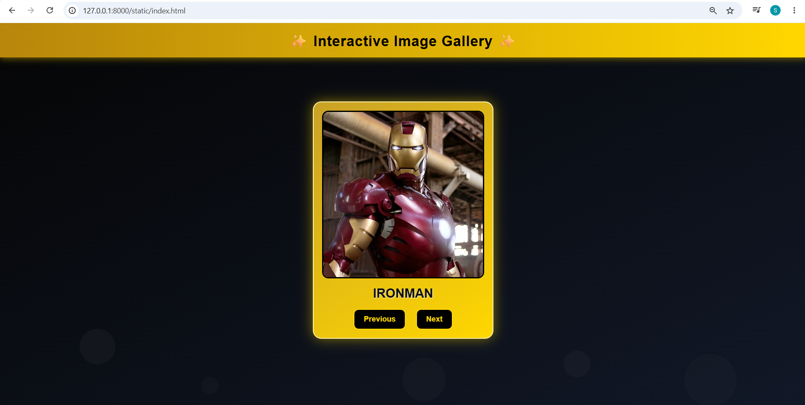
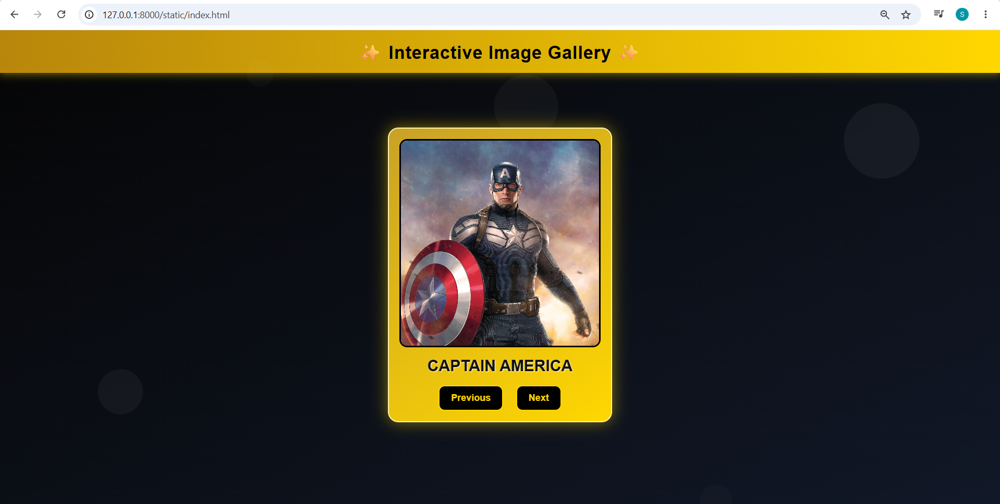
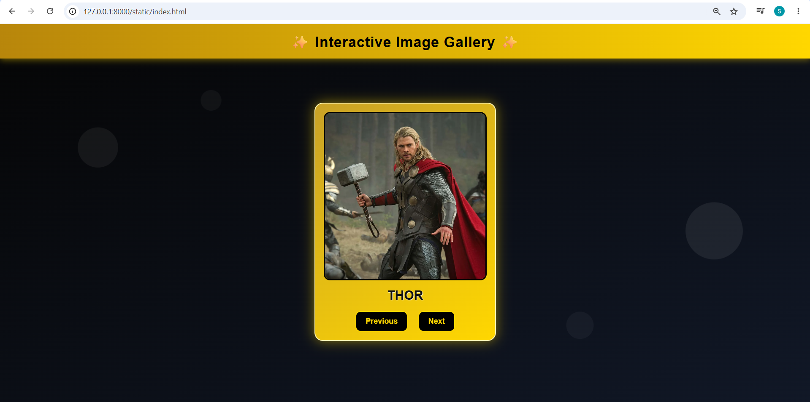
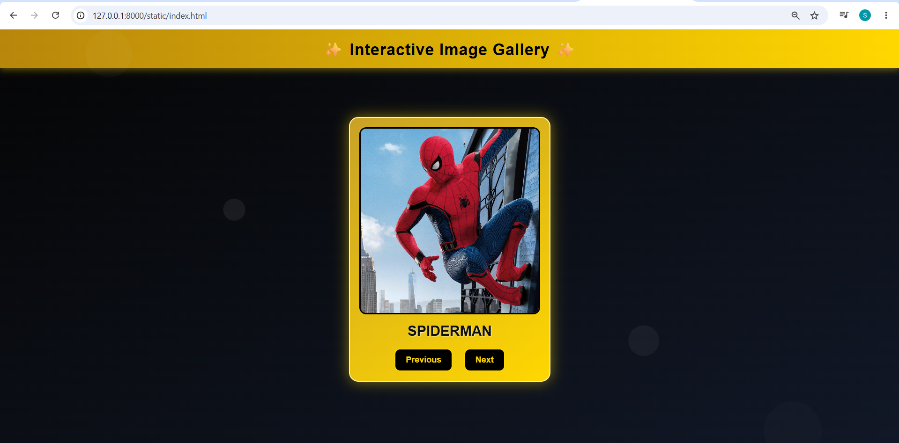
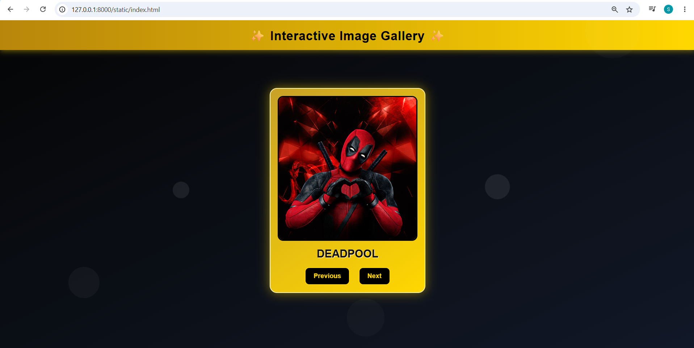

# Ex.07 Design of Interactive Image Gallery

## AIM
  To design a web application for an inteactive image gallery with minimum five images.

## DESIGN STEPS

## Step 1:

Clone the github repository and create Django admin interface

## Step 2:

Change settings.py file to allow request from all hosts.

## Step 3:

Use CSS for positioning and styling.

## Step 4:

Write JavaScript program for implementing interactivit

## Step 5:

Validate the HTML and CSS code

## Step 6:

Publish the website in the given URL.

## PROGRAM
```html
index.html
<!DOCTYPE html>
<html lang="en">
<head>
    <meta charset="UTF-8">
    <meta name="viewport" content="width=device-width, initial-scale=1.0">
    <title>Interactive Image Gallery</title>

    <link rel="stylesheet" href="style.css">
</head>

<body>

    <!-- Background bubbles -->
    <div class="bubble"></div>
    <div class="bubble"></div>
    <div class="bubble"></div>
    <div class="bubble"></div>
    <div class="bubble"></div>

    <div class="header">
        ✨ Interactive Image Gallery ✨
    </div>

    <div class="container">

        <div class="gallery-card">

            

            <div class="caption" id="caption">
                IRONMAN
            </div>

            <div class="buttons">
                <button onclick="previousImage()">Previous</button>
                <button onclick="nextImage()">Next</button>
            </div>

        </div>

    </div>

    <script src="script.js"></script>

</body>
</html>
```
```js
script.js
const gallery = [

    {
        image:"pic1.jpeg",
        text:"IRONMAN"
    },

    {
        image:"pic2.jpeg",
        text:"CAPTAIN AMERICA"
    },

    {
        image:"img3.webp",
        text:"THOR"
    },

    {
        image:"img4.jpeg",
        text:"SPIDERMAN"
    },

    {
        image:"img5.jpeg",
        text:"DEADPOOL"
    }

];

let currentIndex = 0;

const image = document.getElementById("galleryImage");
const caption = document.getElementById("caption");

function showImage(index){

    image.style.opacity = 0;

    setTimeout(() => {

        image.src = gallery[index].image;
        caption.innerText = gallery[index].text;

        image.style.opacity = 1;

    }, 200);
}

function nextImage(){

    currentIndex++;

    if(currentIndex >= gallery.length){
        currentIndex = 0;
    }

    showImage(currentIndex);
}

function previousImage(){

    currentIndex--;

    if(currentIndex < 0){
        currentIndex = gallery.length - 1;
    }

    showImage(currentIndex);
}
```
```css
style.css
*{
    margin:0;
    padding:0;
    box-sizing:border-box;
    font-family:Arial, Helvetica, sans-serif;
}

body{
    background:linear-gradient(to bottom right,#050505,#111827);
    overflow:hidden;
    min-height:100vh;
    position:relative;
}

/* Animated Bubbles */

.bubble{
    position:absolute;
    bottom:-120px;
    background:rgba(255,255,255,0.08);
    border-radius:50%;
    animation:float 15s infinite linear;
}

.bubble:nth-child(1){
    width:80px;
    height:80px;
    left:10%;
    animation-duration:12s;
}

.bubble:nth-child(2){
    width:40px;
    height:40px;
    left:25%;
    animation-duration:18s;
}

.bubble:nth-child(3){
    width:100px;
    height:100px;
    left:50%;
    animation-duration:20s;
}

.bubble:nth-child(4){
    width:60px;
    height:60px;
    left:70%;
    animation-duration:14s;
}

.bubble:nth-child(5){
    width:120px;
    height:120px;
    left:85%;
    animation-duration:22s;
}

@keyframes float{
    0%{
        transform:translateY(0) scale(1);
        opacity:0;
    }

    50%{
        opacity:1;
    }

    100%{
        transform:translateY(-120vh) scale(1.3);
        opacity:0;
    }
}

.header{
    width:100%;
    background:linear-gradient(to right,#b8860b,#ffd700);
    color:black;
    text-align:center;
    padding:18px;
    font-size:34px;
    font-weight:bold;
    letter-spacing:1px;
    box-shadow:0 4px 15px rgba(255,215,0,0.4);
}

.container{
    height:85vh;
    display:flex;
    justify-content:center;
    align-items:center;
    position:relative;
    z-index:2;
}

.gallery-card{
    background:linear-gradient(145deg,#c9a227,#ffd700);
    padding:20px;
    border-radius:20px;
    width:430px;
    text-align:center;
    box-shadow:0 0 30px rgba(255,215,0,0.5);
    border:2px solid #fff4b0;
}

.gallery-card img{
    width:100%;
    height:400px;
    object-fit:cover;
    border-radius:15px;
    border:3px solid black;
    transition:0.3s;
}

.caption{
    margin-top:15px;
    font-size:30px;
    color:#111;
    font-weight:bold;
    text-shadow:1px 1px 2px white;
}

.buttons{
    margin-top:20px;
}

button{
    background:black;
    color:gold;
    border:2px solid gold;
    padding:12px 22px;
    margin:0 10px;
    border-radius:12px;
    font-size:18px;
    cursor:pointer;
    transition:0.3s;
    font-weight:bold;
}

button:hover{
    background:gold;
    color:black;
    transform:scale(1.08);
    box-shadow:0 0 15px gold;
}
```

## OUTPUT











## RESULT
  The program for designing an interactive image gallery using HTML, CSS and JavaScript is executed successfully.
